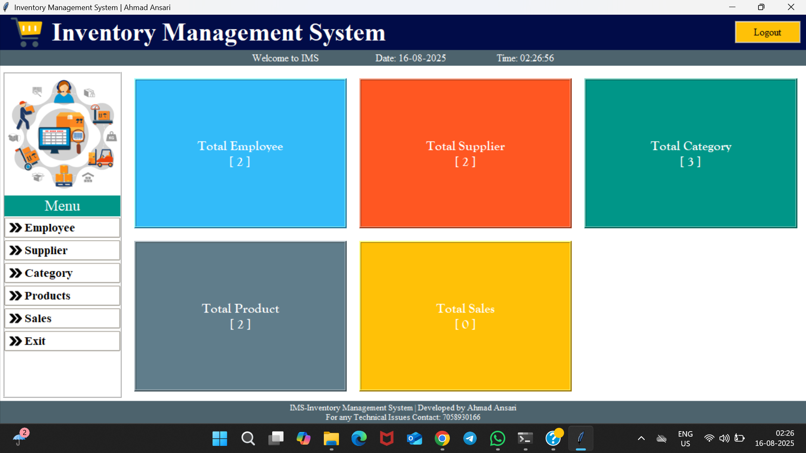
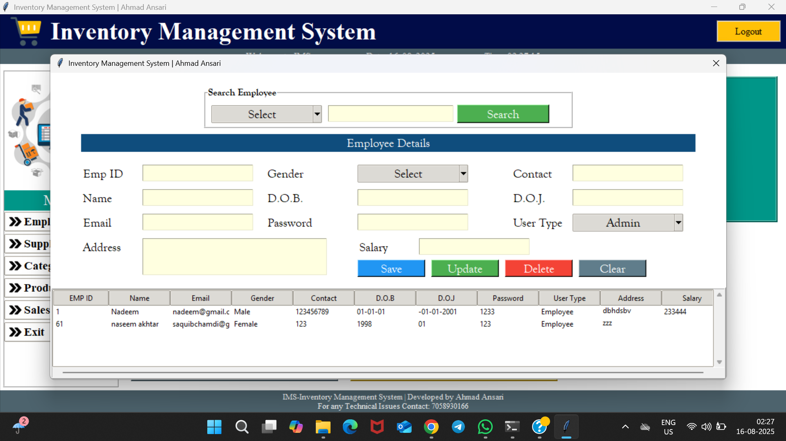
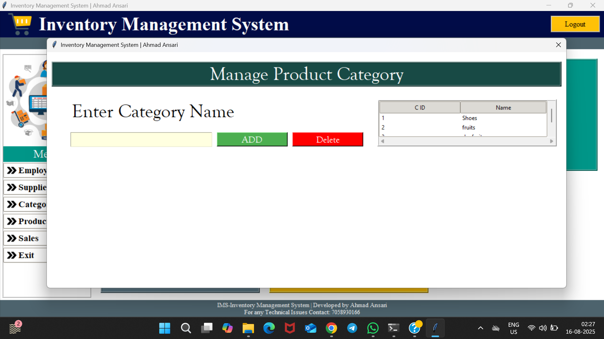
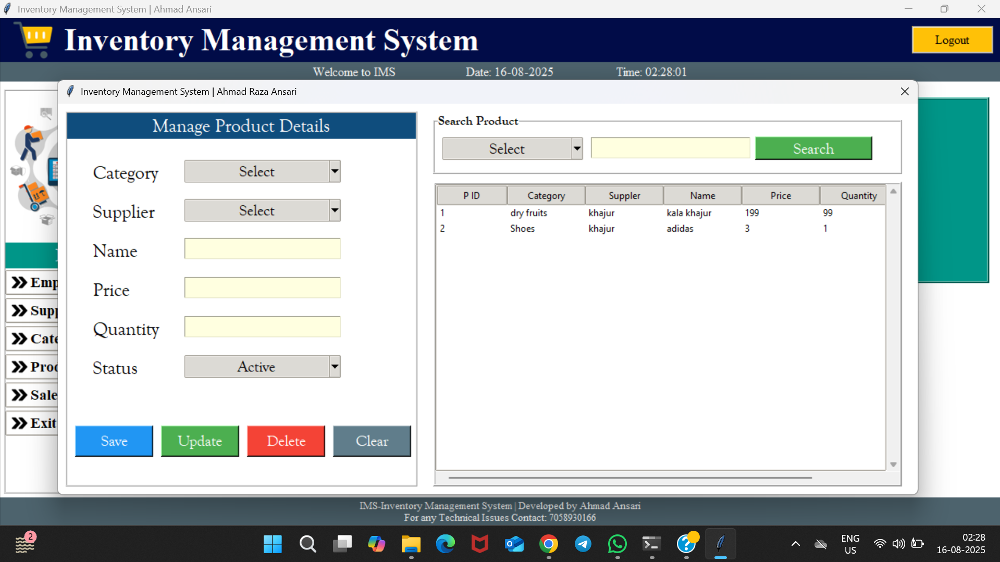
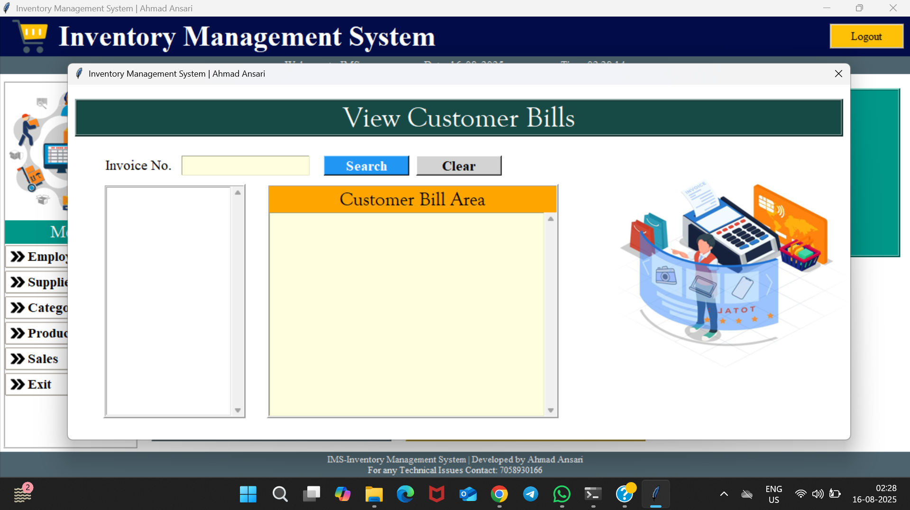

# Inventory Management System (Tkinter)

A desktop application for inventory management with employee, supplier, product, and sales modules.

## Screenshots

# Inventory Management System (Tkinter)



A comprehensive desktop application for inventory management built with Python Tkinter.

## Features
- Employee management module
- Supplier tracking system
- Product categorization
- Inventory control
- Sales and billing system
- PDF invoice generation
- SQLite database backend

## Screenshots

### Dashboard


### Employee Management


### Supplier Management


### Product Categories


### Product Management


### Sales & Billing


## Installation

### Using Pre-built Executable
1. Download the latest release
2. Run `ready.exe` from the `dist` folder
3. The app will automatically:
   - Create database file (`ims.db`)
   - Generate `bills` folder for invoices

### Building from Source
```bash
git clone https://github.com/Ahmadraza301/Inventory-Management-System.git
cd Inventory-Management-System
pip install -r requirements.txt
pyinstaller --onefile --windowed dashboard.py

## Installation

### Quick Start (Using Pre-built Executable)

1. Download the latest release from the [Releases page](https://github.com/Ahmadraza301/Inventory-Management-System/releases)
2. Double-click `ready.exe` in the `dist` folder
3. The application will automatically:
   - Create `ims.db` database file if missing
   - Create a `bills` folder for invoices

## Building from Source

```bash
# Clone repository
git clone https://github.com/Ahmadraza301/Inventory-Management-System.git
cd Inventory-Management-System

# Install dependencies
pip install -r requirements.txt

# Build executable
pyinstaller --onefile --windowed dashboard.py
